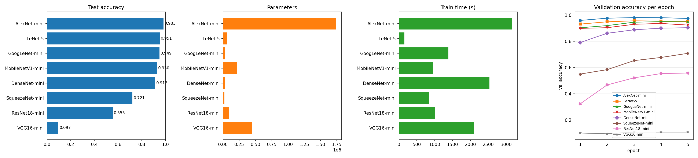
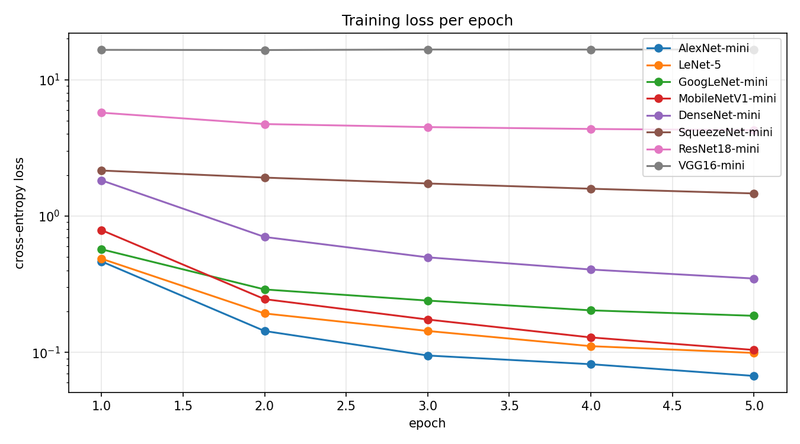
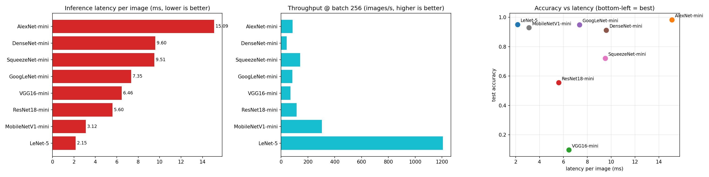
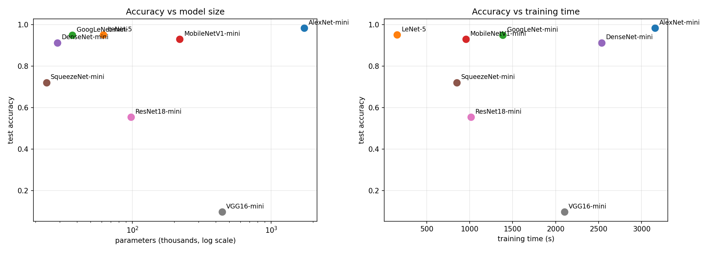
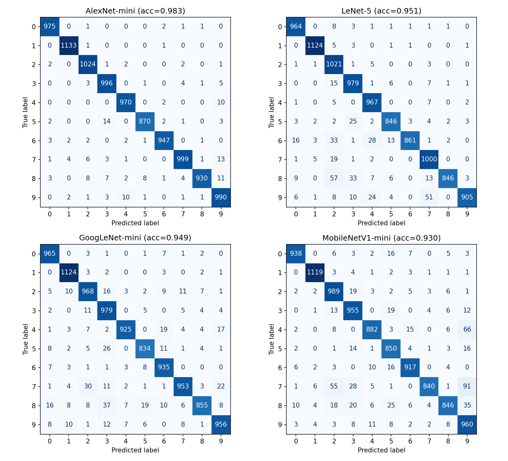
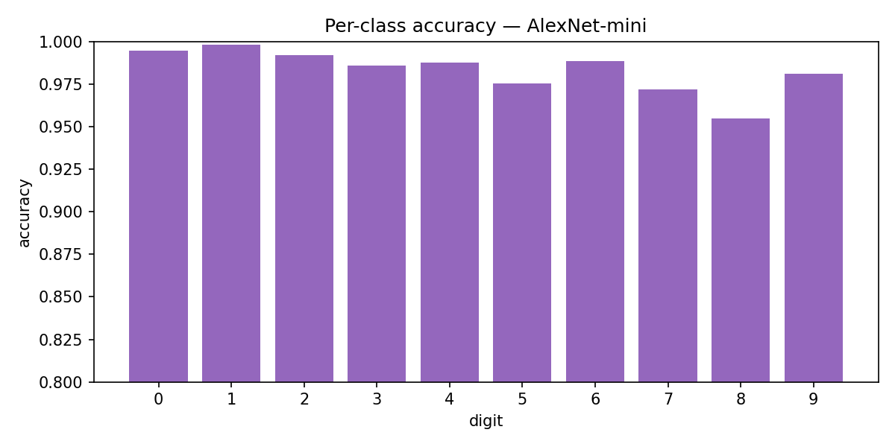
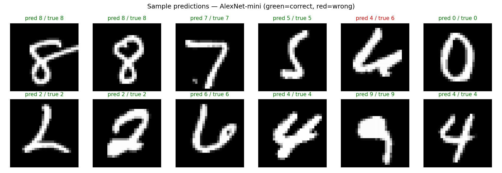
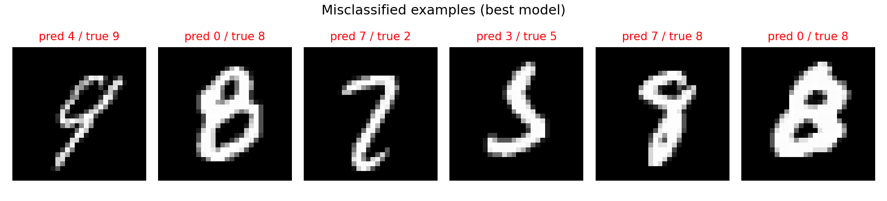

# CNN Benchmark Report

> Generated 2026-09-22 16:26:13 UTC · 8 architectures · best test accuracy **98.3%** (AlexNet-mini)

## Contents

- [Overview and settings](#overview-and-settings)
- [What was compared](#what-was-compared)
- [How it was run](#how-it-was-run)
- [Results](#results)
- [Head-to-head comparison](#head-to-head-comparison)
- [Training traces](#training-traces)
- [Charts](#charts)
- [Per-model confusion and accuracy trends](#per-model-confusion-and-accuracy-trends)
- [Notes and caveats](#notes-and-caveats)
- [Artifacts](#artifacts)

## Overview and settings

- **Generated:** 2026-09-22 16:26:13 UTC
- **Python:** 3.13.15 · **NumPy:** 2.1.3
- **Platform:** Linux-6.6.122+-x86_64-with-glibc2.39
- **Models benchmarked:** 8
- **Training samples:** 20,000
- **Epochs:** 5
- **Batch size:** 64
- **Learning rate:** 0.001
- **Dataset:** MNIST - 60k train / 10k test, 28x28x1, 10 classes
- **Optimizer:** Adam (lr from cell 3)
- **Loss:** cross-entropy

## What was compared

Eight classic CNN architectures rebuilt **from scratch** on the custom NumPy autograd library (`nn/`), all on the same data split and the same training harness — so differences reflect the architectural *patterns*, not the plumbing.

| Model | Key idea reproduced | Params |
|---|---|---|
| AlexNet-mini | big convs + dropout fully-connected head | 1,733,258 |
| LeNet-5 | the original 1998 CNN (conv -> pool -> fully-connected) | 61,706 |
| GoogLeNet-mini | inception modules (parallel 1x1 / 3x3 / pool branches) | 36,974 |
| MobileNetV1-mini | depthwise-separable style bottleneck conv chain | 219,570 |
| DenseNet-mini | dense concatenation of every preceding feature map | 28,778 |
| SqueezeNet-mini | fire modules: 1x1 squeeze -> 1x1 + 3x3 expand | 24,066 |
| ResNet18-mini | residual blocks with shortcut connections | 97,802 |
| VGG16-mini | stacked 3x3 convs, channels double while pooling halves | 443,386 |

## How it was run

- **Library:** `nn/` — a from-scratch NumPy autograd engine (vectorized im2col `Conv2D`, vectorized pooling, reverse-mode autograd). Gradient checks (analytic vs numerical) and a one-step smoke test on every architecture ran before the benchmark.
- **Data:** MNIST images scaled to [0, 1] and shaped `(N, 28, 28, 1)`, split into train / held-out validation / test as stored in `mnist.npz`.
- **Training:** Adam (lr=0.001, mini-batches of 64, 5 epoch(s), 20,000 training samples) minimising cross-entropy; each model gets one warm-up forward pass to materialise lazily-built layers before its parameters are counted and the timed training loop starts.
- **Evaluation:** validation accuracy after every epoch on a held-out slice; the headline number is final test accuracy on the test split.
- **Latency protocol:** single-image inference timed with warm-up + 30 runs (mean and p95 reported), batch-256 throughput averaged over 5 passes, and a full train step (forward + backward, batch 64).

## Results

| # | Model | Params | Final loss | Val acc | Test acc | Train (s) | Infer (ms) | p95 (ms) | Throughput (img/s) | Train step (ms) | Δ vs best |
|---|---|---|---|---|---|---|---|---|---|---|---|
| 1 | AlexNet-mini | 1,733,258 | 0.067 | 97.5% | 98.3% | 3,154.7 | 15.09 | 20.88 | 85 | 1735.2 | &mdash; |
| 2 | LeNet-5 | 61,706 | 0.099 | 95.0% | 95.1% | 156.5 | 2.15 | 3.28 | 1,206 | 208.9 | -3.2 pp |
| 3 | GoogLeNet-mini | 36,974 | 0.185 | 94.8% | 94.9% | 1,385.7 | 7.35 | 9.41 | 83 | 791.2 | -3.4 pp |
| 4 | MobileNetV1-mini | 219,570 | 0.104 | 92.4% | 93.0% | 956.3 | 3.12 | 4.42 | 304 | 661.8 | -5.4 pp |
| 5 | DenseNet-mini | 28,778 | 0.348 | 90.4% | 91.2% | 2,533.3 | 9.60 | 12.84 | 41 | 1319.4 | -7.1 pp |
| 6 | SqueezeNet-mini | 24,066 | 1.464 | 70.9% | 72.1% | 849.3 | 9.51 | 10.74 | 142 | 530.2 | -26.2 pp |
| 7 | ResNet18-mini | 97,802 | 4.264 | 55.9% | 55.5% | 1,013.4 | 5.60 | 6.83 | 115 | 470.9 | -42.9 pp |
| 8 | VGG16-mini | 443,386 | 16.668 | 10.8% | 9.7% | 2,101.5 | 6.46 | 7.59 | 70 | 1169.5 | -88.6 pp |

*Ranked by test accuracy. Δ is the gap to the best model in percentage points (pp).*

## Head-to-head comparison

- **Accuracy leader:** **AlexNet-mini** at 98.3% test accuracy, +3.2 pp ahead of LeNet-5; VGG16-mini is last at 9.7% (88.6 pp behind the winner).
- **Learned vs. didn't:** 7 of 8 models clearly learned the task (>15% test acc); VGG16-mini finished at chance level (10.0%).
- **Convergence:** lowest final loss AlexNet-mini (0.067) vs highest VGG16-mini (16.668); loss *rose* during training for VGG16-mini — those diverged.
- **Cost:** LeNet-5 trained fastest (156.5s), AlexNet-mini slowest (3,154.7s) — a 20× spread for identical data and epochs.
- **Most efficient:** LeNet-5 buys the most accuracy per training second (0.0061 acc/s).
- **Size:** SqueezeNet-mini is smallest (24,066 params), AlexNet-mini largest (1,733,258); DenseNet-mini extracts the most accuracy per parameter.
- **Latency:** LeNet-5 serves one image in 2.15ms on average, AlexNet-mini needs 15.09ms (7× apart); best throughput LeNet-5 at 1,206 img/s (batch 256).

## Training traces

| Model | Epochs | Loss (start → end) | Val acc (start → end) | Test acc |
|---|---|---|---|---|
| AlexNet-mini | 5 | 0.464 → 0.067 (-86%) | 96.0% → 97.5% | 98.3% |
| LeNet-5 | 5 | 0.486 → 0.099 (-80%) | 93.2% → 95.0% | 95.1% |
| GoogLeNet-mini | 5 | 0.570 → 0.185 (-68%) | 90.3% → 94.8% | 94.9% |
| MobileNetV1-mini | 5 | 0.789 → 0.104 (-87%) | 89.9% → 92.4% | 93.0% |
| DenseNet-mini | 5 | 1.828 → 0.348 (-81%) | 79.1% → 90.4% | 91.2% |
| SqueezeNet-mini | 5 | 2.157 → 1.464 (-32%) | 55.0% → 70.9% | 72.1% |
| ResNet18-mini | 5 | 5.728 → 4.264 (-26%) | 32.4% → 55.9% | 55.5% |
| VGG16-mini | 5 | 16.559 → 16.668 (+1%) | 10.1% → 10.8% | 9.7% |

## Charts

### Accuracy cost and convergence

Four views of the same race: test accuracy, parameter count, training time, and validation accuracy per epoch. **AlexNet-mini** leads at 98.3%; the field spans 9.7%–98.3%. Size ranges from SqueezeNet-mini (24,066 params) to AlexNet-mini (1,733,258 params). Slowest to train: AlexNet-mini (3,154.7s).

### Training loss curves

Cross-entropy per epoch on a log scale. **AlexNet-mini** converges lowest at 0.067. Loss *increased* over training for VGG16-mini — those runs diverged.

### Latency and throughput

**LeNet-5** answers one image in 2.15ms on average; **AlexNet-mini** is slowest at 15.09ms — a 7× spread. At batch 256, LeNet-5 pushes the most images/s (1,206). Cheapest training step: LeNet-5 (208.9ms).

### Accuracy versus cost

Accuracy plotted against model size and against training time — the top-left/top-right corners are the efficient frontier. Parameter counts span 24,066–1,733,258. Most accuracy per training second: **LeNet-5** (0.0061 acc/s); overall accuracy leader is **AlexNet-mini**.

### Confusion matrices

Confusion matrices for the top 4 models by test accuracy — AlexNet-mini (98.3%), LeNet-5 (95.1%), GoogLeNet-mini (94.9%), MobileNetV1-mini (93.0%). Off-diagonal cells show where each model confuses digits.

### Per-class accuracy

Per-digit accuracy of the winning model, **AlexNet-mini** (overall 98.3%). Bars reveal which digits are individually hard — 4/7/9 are classically the messy ones on MNIST.

### Sample predictions

Random test images with AlexNet-mini's predictions — green = correct, red = wrong (overall 98.3%).

### Misclassifications

Examples AlexNet-mini gets wrong — useful for judging whether errors look genuinely ambiguous (4 vs 9) or systematic.

## Per-model confusion and accuracy trends

Per model: how accuracy moved epoch over epoch (classified from the actual deltas) and — where confusion matrices were recorded — the full 10×10 confusion matrix with the dominant error pair and hardest digit.

### AlexNet-mini

**Accuracy trend:** train 97.0% → 99.0%, val 96.0% → 97.5% over 5 epochs — **improving** (+1.5 pp), peaked at epoch 3.

**Confusion:** Rows are the true digit, columns the prediction; the diagonal reproduces **98.3%** accuracy (9,834/10,000 test images); most confounded pair **5 → 3** (14 images); hardest digit **8** (recall 95.5%), easiest 1 (99.8%).

| true \ pred | 0 | 1 | 2 | 3 | 4 | 5 | 6 | 7 | 8 | 9 |
|---|---|---|---|---|---|---|---|---|---|---|
| 0 | 975 | 0 | 1 | 0 | 0 | 0 | 2 | 1 | 1 | 0 |
| 1 | 0 | 1133 | 1 | 0 | 0 | 0 | 1 | 0 | 0 | 0 |
| 2 | 2 | 0 | 1024 | 1 | 2 | 0 | 0 | 2 | 0 | 1 |
| 3 | 0 | 0 | 3 | 996 | 0 | 1 | 0 | 4 | 1 | 5 |
| 4 | 0 | 0 | 0 | 0 | 970 | 0 | 2 | 0 | 0 | 10 |
| 5 | 2 | 0 | 0 | 14 | 0 | 870 | 2 | 1 | 0 | 3 |
| 6 | 3 | 2 | 2 | 0 | 2 | 1 | 947 | 0 | 1 | 0 |
| 7 | 1 | 4 | 6 | 3 | 1 | 0 | 0 | 999 | 1 | 13 |
| 8 | 3 | 0 | 8 | 7 | 2 | 8 | 1 | 4 | 930 | 11 |
| 9 | 0 | 2 | 1 | 3 | 10 | 1 | 0 | 1 | 1 | 990 |

### LeNet-5

**Accuracy trend:** train 93.8% → 96.3%, val 93.2% → 95.0% over 5 epochs — **improving** (+1.9 pp), peaked at epoch 3.

**Confusion:** Rows are the true digit, columns the prediction; the diagonal reproduces **95.1%** accuracy (9,513/10,000 test images); most confounded pair **8 → 2** (57 images); hardest digit **8** (recall 86.9%), easiest 1 (99.0%).

| true \ pred | 0 | 1 | 2 | 3 | 4 | 5 | 6 | 7 | 8 | 9 |
|---|---|---|---|---|---|---|---|---|---|---|
| 0 | 964 | 0 | 8 | 3 | 1 | 1 | 1 | 1 | 1 | 0 |
| 1 | 0 | 1124 | 5 | 3 | 0 | 1 | 1 | 0 | 0 | 1 |
| 2 | 1 | 1 | 1021 | 1 | 5 | 0 | 0 | 3 | 0 | 0 |
| 3 | 0 | 0 | 15 | 979 | 1 | 6 | 0 | 7 | 1 | 1 |
| 4 | 1 | 0 | 5 | 0 | 967 | 0 | 0 | 7 | 0 | 2 |
| 5 | 3 | 2 | 2 | 25 | 2 | 846 | 3 | 4 | 2 | 3 |
| 6 | 16 | 3 | 33 | 1 | 28 | 13 | 861 | 1 | 2 | 0 |
| 7 | 1 | 5 | 19 | 1 | 2 | 0 | 0 | 1000 | 0 | 0 |
| 8 | 9 | 0 | 57 | 33 | 7 | 6 | 0 | 13 | 846 | 3 |
| 9 | 6 | 1 | 8 | 10 | 24 | 4 | 0 | 51 | 0 | 905 |

### GoogLeNet-mini

**Accuracy trend:** train 90.8% → 95.4%, val 90.3% → 94.8% over 5 epochs — **improving** (+4.5 pp), peaked at epoch 4.

**Confusion:** Rows are the true digit, columns the prediction; the diagonal reproduces **94.9%** accuracy (9,494/10,000 test images); most confounded pair **8 → 3** (37 images); hardest digit **8** (recall 87.8%), easiest 1 (99.0%).

| true \ pred | 0 | 1 | 2 | 3 | 4 | 5 | 6 | 7 | 8 | 9 |
|---|---|---|---|---|---|---|---|---|---|---|
| 0 | 965 | 0 | 3 | 1 | 0 | 1 | 7 | 1 | 2 | 0 |
| 1 | 0 | 1124 | 3 | 2 | 0 | 0 | 3 | 0 | 2 | 1 |
| 2 | 5 | 10 | 968 | 16 | 3 | 2 | 9 | 11 | 7 | 1 |
| 3 | 2 | 0 | 11 | 979 | 0 | 5 | 0 | 5 | 4 | 4 |
| 4 | 1 | 3 | 7 | 2 | 925 | 0 | 19 | 4 | 4 | 17 |
| 5 | 8 | 2 | 5 | 26 | 0 | 834 | 11 | 1 | 4 | 1 |
| 6 | 7 | 3 | 1 | 1 | 3 | 8 | 935 | 0 | 0 | 0 |
| 7 | 1 | 4 | 30 | 11 | 2 | 1 | 1 | 953 | 3 | 22 |
| 8 | 16 | 8 | 8 | 37 | 7 | 19 | 10 | 6 | 855 | 8 |
| 9 | 8 | 10 | 1 | 12 | 7 | 6 | 0 | 8 | 1 | 956 |

### MobileNetV1-mini

**Accuracy trend:** train 91.3% → 96.5%, val 89.9% → 92.4% over 5 epochs — **improving** (+2.5 pp), peaked at epoch 4.

**Confusion:** Rows are the true digit, columns the prediction; the diagonal reproduces **93.0%** accuracy (9,296/10,000 test images); most confounded pair **7 → 9** (91 images); hardest digit **7** (recall 81.7%), easiest 1 (98.6%).

| true \ pred | 0 | 1 | 2 | 3 | 4 | 5 | 6 | 7 | 8 | 9 |
|---|---|---|---|---|---|---|---|---|---|---|
| 0 | 938 | 0 | 6 | 3 | 2 | 16 | 7 | 0 | 5 | 3 |
| 1 | 0 | 1119 | 3 | 4 | 1 | 2 | 3 | 1 | 1 | 1 |
| 2 | 2 | 2 | 989 | 19 | 3 | 2 | 5 | 3 | 6 | 1 |
| 3 | 0 | 1 | 13 | 955 | 0 | 19 | 0 | 4 | 6 | 12 |
| 4 | 2 | 0 | 8 | 0 | 882 | 3 | 15 | 0 | 6 | 66 |
| 5 | 2 | 0 | 1 | 14 | 1 | 850 | 4 | 1 | 3 | 16 |
| 6 | 6 | 2 | 3 | 0 | 10 | 16 | 917 | 0 | 4 | 0 |
| 7 | 1 | 6 | 55 | 28 | 5 | 1 | 0 | 840 | 1 | 91 |
| 8 | 10 | 4 | 18 | 20 | 6 | 25 | 6 | 4 | 846 | 35 |
| 9 | 3 | 4 | 3 | 8 | 11 | 8 | 2 | 2 | 8 | 960 |

### DenseNet-mini

**Accuracy trend:** train 78.3% → 90.7%, val 79.1% → 90.4% over 5 epochs — **strongly improving** (+11.3 pp), still climbing at the final epoch.

**Confusion:** Rows are the true digit, columns the prediction; the diagonal reproduces **91.2%** accuracy (9,125/10,000 test images); most confounded pair **9 → 7** (97 images); hardest digit **9** (recall 80.6%), easiest 1 (98.6%).

| true \ pred | 0 | 1 | 2 | 3 | 4 | 5 | 6 | 7 | 8 | 9 |
|---|---|---|---|---|---|---|---|---|---|---|
| 0 | 949 | 0 | 2 | 3 | 1 | 0 | 13 | 2 | 9 | 1 |
| 1 | 0 | 1119 | 3 | 5 | 1 | 0 | 4 | 0 | 3 | 0 |
| 2 | 5 | 3 | 924 | 55 | 2 | 0 | 14 | 15 | 12 | 2 |
| 3 | 0 | 6 | 5 | 956 | 0 | 11 | 0 | 22 | 8 | 2 |
| 4 | 0 | 0 | 2 | 4 | 857 | 0 | 45 | 9 | 12 | 53 |
| 5 | 5 | 3 | 1 | 81 | 0 | 770 | 16 | 6 | 5 | 5 |
| 6 | 5 | 4 | 1 | 0 | 6 | 5 | 934 | 0 | 3 | 0 |
| 7 | 0 | 12 | 15 | 7 | 2 | 1 | 0 | 969 | 5 | 17 |
| 8 | 8 | 9 | 2 | 53 | 8 | 9 | 27 | 21 | 834 | 3 |
| 9 | 8 | 17 | 4 | 29 | 30 | 0 | 1 | 97 | 10 | 813 |

### SqueezeNet-mini

**Accuracy trend:** train 50.8% → 71.1%, val 55.0% → 70.9% over 5 epochs — **strongly improving** (+15.8 pp), still climbing at the final epoch.

**Confusion:** Rows are the true digit, columns the prediction; the diagonal reproduces **72.1%** accuracy (7,212/10,000 test images); most confounded pair **5 → 3** (190 images); hardest digit **5** (recall 33.3%), easiest 1 (94.6%).

| true \ pred | 0 | 1 | 2 | 3 | 4 | 5 | 6 | 7 | 8 | 9 |
|---|---|---|---|---|---|---|---|---|---|---|
| 0 | 916 | 3 | 11 | 18 | 1 | 0 | 23 | 1 | 4 | 3 |
| 1 | 0 | 1074 | 1 | 5 | 0 | 0 | 11 | 1 | 0 | 43 |
| 2 | 10 | 13 | 778 | 120 | 4 | 1 | 55 | 40 | 8 | 3 |
| 3 | 9 | 25 | 123 | 722 | 0 | 3 | 19 | 48 | 39 | 22 |
| 4 | 4 | 24 | 9 | 0 | 601 | 1 | 93 | 10 | 54 | 186 |
| 5 | 18 | 84 | 23 | 190 | 7 | 297 | 102 | 39 | 90 | 42 |
| 6 | 10 | 37 | 12 | 2 | 21 | 5 | 866 | 0 | 2 | 3 |
| 7 | 3 | 48 | 23 | 16 | 4 | 0 | 7 | 846 | 24 | 57 |
| 8 | 21 | 80 | 18 | 112 | 10 | 5 | 82 | 61 | 398 | 187 |
| 9 | 9 | 37 | 8 | 10 | 65 | 1 | 34 | 49 | 82 | 714 |

### ResNet18-mini

**Accuracy trend:** train 30.6% → 57.2%, val 32.4% → 55.9% over 5 epochs — **strongly improving** (+23.5 pp), still climbing at the final epoch.

**Confusion:** Rows are the true digit, columns the prediction; the diagonal reproduces **55.5%** accuracy (5,546/10,000 test images); most confounded pair **4 → 9** (443 images); hardest digit **3** (recall 0.0%), easiest 1 (96.1%).

| true \ pred | 0 | 1 | 2 | 3 | 4 | 5 | 6 | 7 | 8 | 9 |
|---|---|---|---|---|---|---|---|---|---|---|
| 0 | 592 | 0 | 10 | 0 | 24 | 0 | 118 | 0 | 123 | 113 |
| 1 | 6 | 1091 | 4 | 0 | 4 | 0 | 18 | 0 | 9 | 3 |
| 2 | 34 | 8 | 763 | 0 | 16 | 0 | 111 | 14 | 31 | 55 |
| 3 | 35 | 9 | 272 | 0 | 5 | 0 | 67 | 73 | 129 | 420 |
| 4 | 53 | 12 | 40 | 0 | 270 | 0 | 132 | 1 | 31 | 443 |
| 5 | 58 | 127 | 67 | 0 | 47 | 0 | 117 | 16 | 230 | 230 |
| 6 | 26 | 31 | 20 | 0 | 35 | 0 | 821 | 0 | 18 | 7 |
| 7 | 4 | 19 | 21 | 0 | 9 | 0 | 1 | 564 | 14 | 396 |
| 8 | 58 | 26 | 25 | 0 | 29 | 0 | 37 | 5 | 577 | 217 |
| 9 | 19 | 30 | 9 | 0 | 20 | 0 | 16 | 6 | 41 | 868 |

### VGG16-mini

**Accuracy trend:** train 9.6% → 8.6%, val 10.1% → 10.8% over 5 epochs — **plateaued** (+0.7 pp), peaked at epoch 3.

**Confusion:** Rows are the true digit, columns the prediction; the diagonal reproduces **9.7%** accuracy (974/10,000 test images); most confounded pair **1 → 8** (1135 images); hardest digit **0** (recall 0.0%), easiest 8 (100.0%).

| true \ pred | 0 | 1 | 2 | 3 | 4 | 5 | 6 | 7 | 8 | 9 |
|---|---|---|---|---|---|---|---|---|---|---|
| 0 | 0 | 0 | 0 | 0 | 0 | 0 | 0 | 0 | 980 | 0 |
| 1 | 0 | 0 | 0 | 0 | 0 | 0 | 0 | 0 | 1135 | 0 |
| 2 | 0 | 0 | 0 | 0 | 0 | 0 | 0 | 0 | 1032 | 0 |
| 3 | 0 | 0 | 0 | 0 | 0 | 0 | 0 | 0 | 1010 | 0 |
| 4 | 0 | 0 | 0 | 0 | 0 | 0 | 0 | 0 | 982 | 0 |
| 5 | 0 | 0 | 0 | 0 | 0 | 0 | 0 | 0 | 892 | 0 |
| 6 | 0 | 0 | 0 | 0 | 0 | 0 | 0 | 0 | 958 | 0 |
| 7 | 0 | 0 | 0 | 0 | 0 | 0 | 0 | 0 | 1028 | 0 |
| 8 | 0 | 0 | 0 | 0 | 0 | 0 | 0 | 0 | 974 | 0 |
| 9 | 0 | 0 | 0 | 0 | 0 | 0 | 0 | 0 | 1009 | 0 |

## Notes and caveats

- **From scratch, not pretrained:** ImageNet weights exist only in PyTorch/TF formats and cannot be loaded into a pure-NumPy autograd engine, so every architecture trains from random init; the comparison is about architectural *patterns*, not pretrained accuracy.
- **Chance level is 10.0%** (10 balanced digit classes) — anything near it did not learn at these settings.
- **Collapsed runs:** VGG16-mini ended at chance level. On 28×28 inputs over few epochs this usually means the optimizer never got traction (learning rate, depth, initialization) rather than that the pattern is wrong — see the loss curves above.
- **Diverging runs:** loss increased for VGG16-mini; lower the learning rate or train longer before trusting their numbers.
- **Reproducibility:** `python -m cnn_benchmark.run_benchmark` (or the Colab notebook, cells in order) with the settings listed above regenerates these results; all numbers here are computed from `results.json`, never hard-coded.

## Artifacts

- `REPORT.md` — this report
- `results.json` — raw metrics behind every table and caption
- `assets/charts_bars.png` — chart image
- `assets/charts_confusion.png` — chart image
- `assets/charts_latency.png` — chart image
- `assets/charts_loss_curves.png` — chart image
- `assets/charts_mistakes.png` — chart image
- `assets/charts_pareto.png` — chart image
- `assets/charts_per_class.png` — chart image
- `assets/charts_samples.png` — chart image
