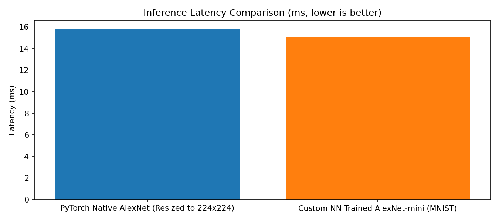
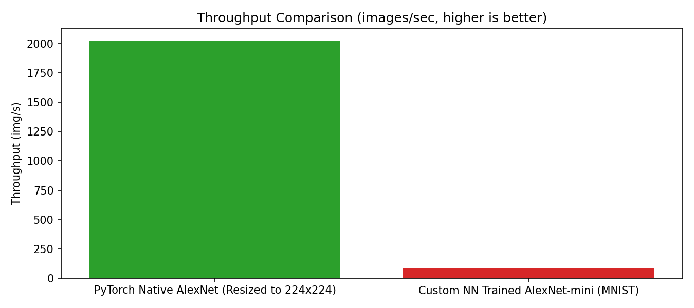

# AlexNet MNIST Benchmark Comparison: PyTorch vs. Custom NN Library

This report compares the **PyTorch Native AlexNet** model against the **Custom NN Library's AlexNet-mini** model, both evaluated on the CUDA device.

## System & Hardware Profile
- **Compute Device**: cuda
- **Evaluation Batch Size**: 32
- **Input Geometry**: PyTorch (Upscaled to 224x224), Custom (1x28x28)

## Performance Comparison Table

| Model / Architecture | Latency (ms) | Throughput (img/s) | Framework |
| :--- | :---: | :---: | :--- |
| **PyTorch Native AlexNet (Resized to 224x224)** | 15.80 | 2025.8 | PyTorch Native |
| **Custom NN Trained AlexNet-mini (MNIST)** | 15.09 | 85.0 | Custom Autograd (CUDA) |

## Visual Analysis

### Inference Latency

### Throughput Profile

